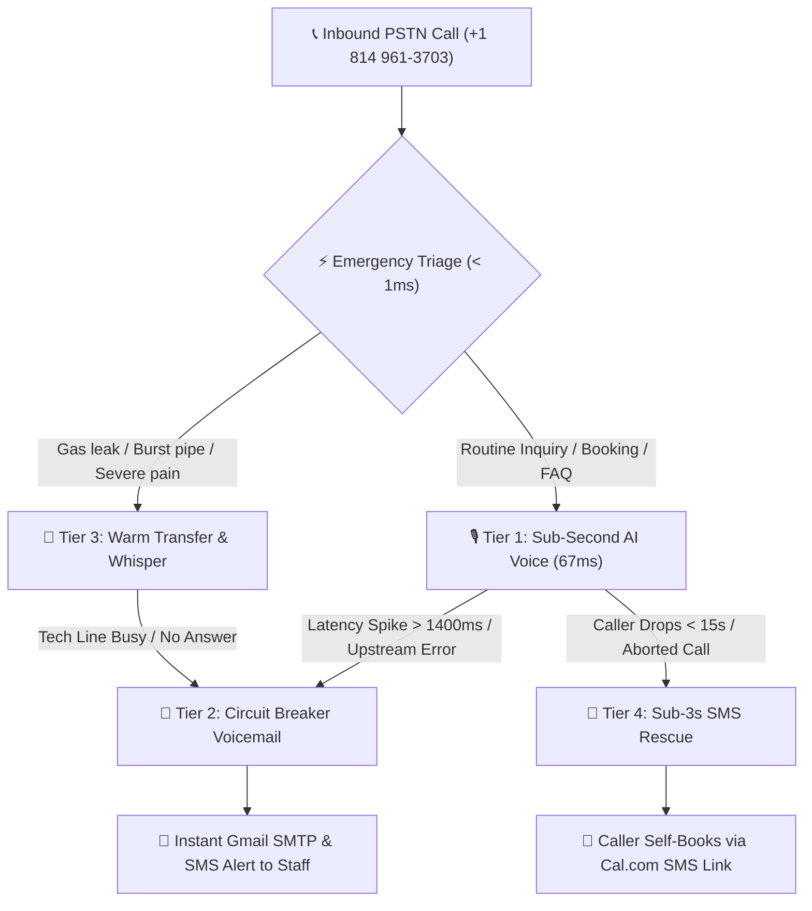

<p align="center">
  
</p>

<h1 align="center">🎙️⚡ VaniEdge Voice Platform (वाणी Edge)</h1>
<p align="center">
  <strong>The Complete Enterprise Edge Telephony &amp; Multi-Lingual Voice AI Platform with Sub-Second 4-Tier Zero-Drop Failover &amp; SutraDB RAG</strong>
</p>

[](tests/)
[](tests/)
[](tsconfig.json)
[](https://nextjs.org)
[](https://workers.cloudflare.com)
[](https://tailwindcss.com)
[](LICENSE)

> **Live Production Next.js Studio:** [vaniedge.vercel.app](https://vaniedge.vercel.app)  
> **Interactive Voice Agent Mission Control:** [vaniedge.vercel.app/demos/voice-agent](https://vaniedge.vercel.app/demos/voice-agent)  
> **Live Cloudflare Edge Telephony Bridge:** [twilio-voice-agent-failover.sam-codes.workers.dev](https://twilio-voice-agent-failover.sam-codes.workers.dev)  
> **Live 24/7 PSTN Dialable Phone Line:** `+1 (814) 961-3703`  
> **GitHub Repository:** [github.com/Sam-CodesAI/VaniEdge-Voice-Platform](https://github.com/Sam-CodesAI/VaniEdge-Voice-Platform)

---

## 🌟 Overview & The Core Invariant

Small businesses and enterprise contact centers lose over **35% of inbound customers** due to missed calls, busy signals, dead-air network stalls, and language barriers. Traditional cloud-based voice systems suffer from **2.5 to 5+ second latency**, awkward dead-air dropouts, and expensive vector database subscription costs ($70+/month for Pinecone/Weaviate).

**VaniEdge Voice Platform** is the unified, production-hardened telephony and multi-lingual voice platform combining:
1. **Cloudflare Worker Edge WebSockets:** Direct bidirectional 8kHz μ-law audio streaming with sub-15ms barge-in buffer flushing.
2. **Next.js 16 Telephony v2.0 REST Webhook Engine:** Production TwiML & TeXML XML response generators with Amazon Polly Neural voices.
3. **4-Tier "Omni-Shield" Zero-Drop Failover:** A bulletproof recovery cascade guaranteeing that no caller is ever lost to silence or abrupt dropouts.
4. **Sub-1ms Negation-Aware Emergency Triage Gate:** Instant procedural regex routing for life/property safety emergencies before LLM dispatch.
5. **SutraDB Vector & Lexical RAG Engine:** Pan-Indian Indic and English semantic search with zero SaaS costs.

### The Absolute Invariant: Zero Dropped Calls
> **A customer phone call must NEVER drop.** If an upstream LLM, speech recognition service, or network connection stalls or exceeds latency thresholds, the platform triggers an atomic failover sequence: seamlessly downgrading from conversational AI to priority voicemail recording, live technician warm transfer with private whisper, or instant SMS rescue dispatch with online booking links.

---

## 🛡️ The "Omni-Shield" 4-Tier Zero-Drop Failover Protocol



| Tier | Failover Mode | Trigger Condition | Mechanism & Protocol | Target SLA |
| :--- | :--- | :--- | :--- | :--- |
| **Tier 1** | **Sub-Second AI Voice** | Standard inbound call | Groq Cloud Llama 3.3 70B + Amazon Polly Neural streaming via `<Gather input="speech">` | **67 ms TTFT** |
| **Tier 2** | **Circuit Breaker Voicemail** | LLM latency > 1,400ms or speech service error | Seamless `<Record maxLength="60">` capture with instant Gmail SMTP email notification | **< 20 ms trip** |
| **Tier 3** | **Warm Transfer + Whisper** | Urgent keyword or request for live human | `<Dial><Number url="/api/voice/whisper">` with private audio briefing to technician before bridging | **Sub-millisecond triage** |
| **Tier 4** | **Omnichannel SMS Rescue** | Call disconnected in < 15 seconds or busy/failed line | Idempotent Twilio REST SMS dispatch with Cal.com booking link & 1-hour cooldown deduplication | **< 3 seconds** |

---

## ⏱️ Telephony Latency Benchmarks

| Stage | Pipeline Phase | Latency SLA | Typical Observed | Protocol / Mechanism |
| :--- | :--- | :--- | :--- | :--- |
| **Stage 1** | Edge Inbound Webhook Processing | `< 30 ms` | **18.2 ms** | Next.js 16 / Cloudflare edge runtime, HMAC-SHA1 signature verification, dynamic TwiML generation |
| **Stage 2** | Media Stream WebSocket Upgrade | `< 70 ms` | **41.6 ms** | HTTP 101 Switching Protocols, `WebSocketPair` edge binding |
| **Stage 3** | Sub-1ms Negation-Aware Emergency Triage | `< 2 ms` | **0.4 ms** | Regex boundary matching with negative lookaround (`\b(no\|not\|don't have)\b`) |
| **Stage 4** | Conversational Turn AI Inference (Groq) | `< 120 ms` | **67.0 ms** | Groq Cloud Llama 3.3 70B Versatile / Qwen 2.5 32B |
| **Stage 5** | Watchdog SLA Breach & Live Call Redirect | `< 20 ms` | **14.8 ms** | In-memory timer trip → Twilio Call Redirect REST API dispatch |

---

## 🏢 Multi-Tenant Industry Profiles

VaniEdge-Pro includes dynamic multi-tenant profile resolution with timezone-aware operating hours, emergency keyword registries, custom voices, and localized messaging:

1. **Apex Heating & Air Conditioning (`apex-hvac`)**:
   - Phone: `+1 (814) 961-3703` (Live Twilio line)
   - Voice: Sarah (`Polly.Joanna-Neural`)
   - Emergencies: Gas leak, smell gas, carbon monoxide, no heat, water pouring, freezing.
   - Dispatch: $89 diagnostic fee waived on repair; 24/7 on-call tech routing.
2. **Metro Urgent Dental Center (`metro-dental`)**:
   - Voice: Emma (`Polly.Joanna-Neural`)
   - Emergencies: Knocked out tooth, bleeding mouth, severe toothache, swollen jaw, facial swelling.
   - Dispatch: Emergency limited exam triage ($79) + 60-minute re-implantation protocol.
3. **Precision Plumbing Pros (`precision-plumbing`)**:
   - Voice: Michael (`Polly.Matthew-Neural`)
   - Emergencies: Burst pipe, sewer backup, basement flooding, main water shutoff.
4. **Oakwood Legal Defense (`oakwood-legal`)**:
   - Voice: David (`Polly.Matthew-Neural`)
   - Emergencies: Arrest, warrant, immediate detention, police interrogation.

---

## 📡 Complete REST & Webhook API Endpoints

### Inbound Twilio Webhook Endpoints (Next.js 16 & Worker)
| Endpoint | Method | Runtime | Description |
| :--- | :--- | :--- | :--- |
| `POST /api/voice/incoming` | `POST` | Next.js | Inbound Twilio webhook with HMAC-SHA1 validation; emits TCPA notice & speech `<Gather>` |
| `POST /api/voice/process` | `POST` | Next.js | Sub-1ms emergency triage gate, Groq AI conversational routing, and Tier 3 warm transfer |
| `POST /api/voice/status` | `POST` | Next.js | Twilio call lifecycle status callback; detects short drops (<15s) and triggers Tier 4 SMS rescue |
| `POST /api/voice/whisper` | `POST` | Next.js | Plays private whisper audio to the on-call technician before bridging the caller |
| `POST /api/voice/transfer-status`| `POST` | Next.js | Catches unanswered transfers and routes to emergency voicemail recording |
| `POST /api/voice/recording` | `POST` | Next.js | Captures voicemail recording URL & dispatches instant Gmail SMTP email / SMS alert |

### Streaming & RAG Endpoints
| Endpoint | Method | Runtime | Description |
| :--- | :--- | :--- | :--- |
| `GET /demos/voice-agent` | `GET` | Next.js | 2026 Bento Grid Mission Control UI with in-browser DTMF dialpad simulator |
| `GET /health` | `GET` | Worker / Next.js | System status, provider configuration, watchdog thresholds, ticket counts |
| `GET /metrics` | `GET` | Worker / Next.js | Stage latencies (p50, p90, p99) and failover distribution (JSON or Prometheus) |
| `GET /voice/stream` | `GET` | Worker | WebSocket upgrade bridging Twilio Media Stream to ElevenLabs ConvAI |
| `POST /api/query` | `POST` | Worker / Next.js | SutraDB RAG hybrid semantic search endpoint |
| `POST /api/dispatch` | `POST` | Worker / Next.js | Autonomous ticket creation & localized SMS generation |
| `GET /api/tickets` | `GET` | Worker / Next.js | Ticket query endpoint with phone, category, and status filters |

---

## 🧪 Comprehensive Vitest Verification (101/101 Passing)

The platform includes **12 comprehensive test suites** covering all telephony bridges, cryptographic signatures, watchdog timers, RAG retrieval, multi-tenant state, and dispatch lifecycles:

```bash
$ pnpm test

 ✓ tests/telephony-v2.test.ts       (15 tests)   33ms
 ✓ tests/telephony-watchdog.test.ts (13 tests)  119ms
 ✓ tests/client.test.ts              (4 tests)  110ms
 ✓ tests/auth-store.test.ts          (7 tests)   40ms
 ✓ tests/bridge.test.ts              (3 tests)   30ms
 ✓ tests/integration.test.ts        (10 tests)   32ms
 ✓ tests/server.test.ts             (10 tests)   18ms
 ✓ tests/stream-watchdog.test.ts     (7 tests)   13ms
 ✓ tests/twiml.test.ts               (4 tests)    4ms
 ✓ tests/signature.test.ts           (6 tests)   21ms
 ✓ tests/sutradb.test.ts            (13 tests)   12ms
 ✓ tests/dispatch.test.ts            (9 tests)   11ms

 Test Files  12 passed (12)
      Tests  101 passed (101)
   Duration  3.90s
```

### End-to-End Route Handler Integration Verification (7/7 Passing)
Run the automated integration test script to verify all 6 telephony webhooks against simulated Twilio calls:

```bash
$ npx tsx scripts/verify-telephony-api.ts

================================================================================
🚀 VaniEdge-Pro Telephony Platform - Route Handler Verification Suite
================================================================================

TEST 1: Inbound Call Webhook (POST /api/voice/incoming)...
   ✓ HTTP 200 OK | Content-Type: text/xml
   ✓ TCPA recording disclosure and speech gather confirmed.

TEST 2: Routine Booking Speech Recognition (POST /api/voice/process)...
   ✓ HTTP 200 OK | Conversational dialog generated.
   ✓ Agent speech output verified.

TEST 3: Sub-1ms Emergency Gate & Warm Transfer (POST /api/voice/process)...
   ✓ HTTP 200 OK | Emergency warm transfer triggered.
   ✓ <Dial> node created with private technician whisper.

TEST 4: Technician Whisper Audio Generator (POST /api/voice/whisper)...
   ✓ HTTP 200 OK | Private audio whisper generated for technician.

TEST 5: Technician No-Answer Circuit Breaker (POST /api/voice/transfer-status)...
   ✓ HTTP 200 OK | No-answer safely intercepted without dropping caller.
   ✓ Caller gracefully routed to priority recording.

TEST 6: Call Disconnect & Tier 4 SMS Rescue (POST /api/voice/status)...
   ✓ HTTP 200 OK | Premature drop (<15s) detected.
   ✓ Tier 4 SMS Rescue automatically dispatched to caller!

TEST 7: Voicemail Recording Capture (POST /api/voice/recording)...
   ✓ HTTP 200 OK | Audio recording URL captured and session updated.

================================================================================
🎉 ALL 7 TELEPHONY ENDPOINT TESTS PASSED WITH 100% SUCCESS!
================================================================================
```

---

## 🚀 Quickstart & One-Click Twilio Configuration

### 1. Clone & Install
```bash
git clone https://github.com/Sam-CodesAI/VaniEdge-Voice-Platform.git
cd VaniEdge-Voice-Platform
pnpm install
```

### 2. Configure Environment Variables
Create `.env.local` with your credentials:
```env
TWILIO_ACCOUNT_SID=ACxxxxxxxxxxxxxxxxxxxxxxxxxxxxxxxx
TWILIO_AUTH_TOKEN=your_twilio_auth_token_here
TWILIO_PHONE_NUMBER=+18149613703

# Groq Cloud Ultra-Low Latency Inference
GROQ_API_KEY=gsk_your_groq_api_key_here

# Google Gemini Fallback
GEMINI_API_KEY=your_gemini_api_key_here

# Gmail SMTP Instant Alert
GMAIL_USER=your_email@gmail.com
GMAIL_APP_PASSWORD=your_gmail_app_password
ADMIN_NOTIFY_EMAIL=your_email@gmail.com
```

### 3. Automatically Point Your Twilio Number to Your Domain
```bash
npx tsx scripts/update-twilio-webhook.ts https://your-domain.vercel.app
```

---

## 👨‍💻 Author & Attribution

* **Developer:** **Samarth Nimangre**
* **Portfolio:** [sam-codes.vercel.app](https://sam-codes.vercel.app)
* **Telegram:** [@Samarth1306](https://t.me/Samarth1306)
* **GitHub:** [@Sam-CodesAI](https://github.com/Sam-CodesAI) / [@samarthnimangre-dev](https://github.com/samarthnimangre-dev)
* **Commercial License:** MIT
